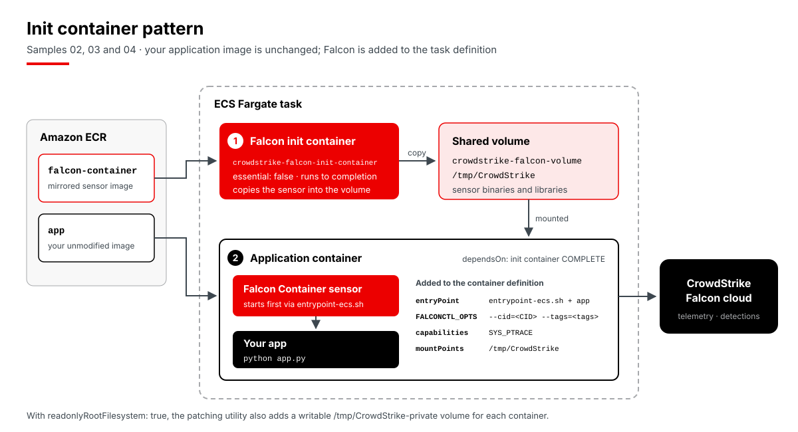
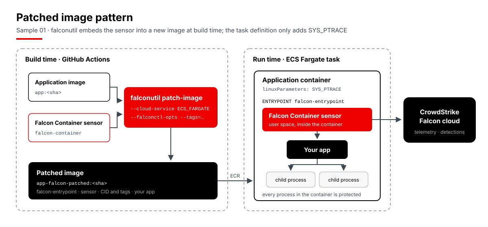

# CrowdStrike Falcon on Amazon ECS Fargate: pipeline samples

This repository shows how to protect Amazon ECS Fargate workloads with the **CrowdStrike Falcon Container sensor** from a GitHub Actions pipeline. Every method starts from the same small Python app and ends with a registered ECS task definition that runs the app with Falcon runtime protection.

Pick the sample that matches how you already deploy to ECS:

| # | Sample | How Falcon is added | Best fit when you... |
|---|--------|---------------------|----------------------|
| 01 | [falconutil patch-image](samples/01-falconutil-patched-image) | The sensor is embedded into a new copy of your image at build time with [`crowdstrike/falconutil-action`](https://github.com/CrowdStrike/falconutil-action) | Ship images through a pipeline, deploy with any tool, and want minimal changes to task definitions |
| 02 | [Terraform module](samples/02-terraform-module) | [`CrowdStrike/terraform-aws-ecs-fargate`](https://github.com/CrowdStrike/terraform-aws-ecs-fargate) builds the task definition with the Falcon init container | Manage ECS with Terraform |
| 03 | [Task definition patch](samples/03-task-definition-patch) | The Falcon patching utility rewrites a task definition JSON file | Register task definitions from JSON (AWS CLI, ECS deploy actions, CodePipeline) |
| 04 | [CloudFormation patch](samples/04-cloudformation-patch) | The Falcon patching utility rewrites a CloudFormation template | Manage ECS with CloudFormation |

An optional [detection container](#detection-container) stage runs CrowdStrike's [detection container](https://github.com/CrowdStrike/detection-container) as a Falcon-protected Fargate task for one hour, so you can see real detections in the Falcon console.

## How the sensor gets into the task

Samples 02 to 04 use the **init container** pattern. The application image is not modified. At task start, a non-essential Falcon init container copies the sensor into a shared volume. The application container then waits for it (`dependsOn: COMPLETE`), mounts the volume, launches through the Falcon entrypoint wrapper, and gets the `SYS_PTRACE` capability.



Sample 01 uses the **patched image** pattern. Those pieces are built into the image at build time, so the task definition only needs `SYS_PTRACE`. The Falcon Container sensor runs in user space inside the application container and protects every process the app starts.



In both patterns, the sensor runs inside each application container and sends telemetry to the CrowdStrike cloud. Fargate gives no access to the host kernel, and the sensor doesn't need it.

## What the pipeline does

[`.github/workflows/cs-ecs-fargate-demo.yaml`](.github/workflows/cs-ecs-fargate-demo.yaml) runs these jobs:

```text
iac-scan ──► build ──┬──► 01 falconutil patch-image ──► register task definition
                     ├──► 02 Terraform module         ──► terraform apply
                     ├──► 03 task definition patch    ──► register task definition
                     ├──► 04 CloudFormation patch     ──► cloudformation deploy
                     └──► detection container         ──► run task, stop it after one hour (optional)
```

1. **iac-scan** scans this repository's Terraform, CloudFormation and task definitions with the [Falcon Cloud Security IaC scanner](https://github.com/CrowdStrike/fcs-action). It uploads the SARIF results to GitHub code scanning and to the Falcon console.
2. **build** does the following:
   - Builds `app/` and scans the image with Falcon Cloud Security image assessment. Pass or fail comes from your **Image Assessment policy** in the Falcon console. The results go to the Falcon console, to GitHub code scanning as SARIF, and to a workflow artifact.
   - Picks the Falcon Container sensor version, so every sample uses the same release.
   - Passes the image to the later jobs as a workflow artifact. This job has no AWS access.
3. **Samples 01-04** run in parallel, and each job is a complete recipe you can copy:
   - It signs in to AWS, then pushes the app image to Amazon ECR using [`.github/actions/publish-images`](.github/actions/publish-images/action.yml).
   - The init container samples (02-04) also mirror the Falcon Container sensor into a private ECR repository using [`falcon-container-sensor-pull.sh`](https://github.com/CrowdStrike/falcon-scripts/tree/main/bash/containers/falcon-container-sensor-pull). The sensor is multi-architecture, and Fargate pulls it at task start.
   - It then registers a Falcon-protected task definition.

The samples register task definitions only; they don't create services. To start a protected task, use any of the resulting task definitions with your own cluster and network:

```bash
aws ecs run-task --cluster <cluster> --launch-type FARGATE \
  --task-definition ecs-fargate-demo-terraform-module \
  --network-configuration 'awsvpcConfiguration={subnets=[subnet-xxxx],securityGroups=[sg-xxxx],assignPublicIp=ENABLED}'
```

The task needs outbound access (a public IP or NAT) to reach ECR and the Falcon cloud. Once it's running, the sensor registers with your Falcon tenant and appears in host management.

### Running a single sample

Pushes to `main` and the weekly scheduled run build all four samples. To run just one, start **Actions → CrowdStrike Falcon ECS Fargate samples → Run workflow** and choose it under **sample**. Choose `none` to run only the scans, or only the detection container. To pin the sensor version, set **falcon_sensor_version** (for example `8.10.0-8002`). Leave it blank to use the latest release.

### Run summary

Each run's **Summary** page shows:

- the scan results, with IaC findings and image vulnerabilities counted by severity (image vulnerabilities by both ExPRT rating and CVSS)
- the sensor version
- one card per sample, built from the task definition ECS registered, showing what Falcon added:
  - the containers and their start order
  - how each application container launches (for example `Falcon wrapper → python app.py`)
  - the `SYS_PTRACE` capability, the sensor volume mounts and the sensor configuration
  - a link to the task definition in the AWS console
  - for sample 01, a before and after of the image's entrypoint and environment

The CID is redacted and ECR hostnames are shortened, so the summary doesn't expose tenant or account identifiers. Scan findings also appear under **Security → Code scanning**, in the `crowdstrike-fcs-iac` and `crowdstrike-fcs-image` categories.

### Sample app versions and scan enforcement

The sample app deliberately pins slightly older releases, so the image assessment has real findings to report: the `python:3.12.7-alpine3.20` base image, plus Flask, Werkzeug, Jinja2, waitress and click. See [`app/requirements.txt`](app/requirements.txt). Update them to current releases before you reuse the app. All scanning in this repository uses CrowdStrike Falcon Cloud Security.

By default, failed scans add a warning and the pipeline keeps going. To block the pipeline on failed scans (the IaC `fail_on` thresholds or the Image Assessment policy), set:

```bash
gh variable set ENFORCE_SCAN_RESULTS --body true
```

## Detection container

Tick **detection_container** when you start **Run workflow** to add this stage. It runs CrowdStrike's [detection container](https://github.com/CrowdStrike/detection-container) on Fargate with Falcon protection:

- **Image:** `quay.io/crowdstrike/detection-container` is patched with `falconutil patch-image` and stored in the `ecs-fargate-demo/detection-container` ECR repository. The image is tagged with the sensor version and the sensor tags, so later runs reuse it and start in seconds.
- **Activity:** the task first runs every bundled detection scenario, about 15 seconds apart. Examples include credential dumping, a reverse shell, ransomware-style file encryption and container drift. After that, it keeps triggering a random scenario every few minutes.
- **Networking:** the task runs in a small VPC that the bootstrap creates. It has public subnets and a security group with **no inbound rules**. The task gets a public IP purely so it can reach ECR and the CrowdStrike cloud without a NAT gateway.
- **Automatic stop:** a one-time EventBridge Scheduler schedule stops the task after **one hour**, then deletes itself. The stop happens even if the GitHub run is cancelled. The task costs a few cents for the hour.

The run summary links to the running task and shows when it will stop. In the Falcon console, the detections carry your sensor grouping tag. You can find the host under **Host setup and management → Manage endpoints → Host management** by filtering on **Pod ID** (the ECS task ID).

## Security model

AWS access uses **GitHub OIDC**, so no long-lived AWS keys are stored in GitHub.

- The IAM role trusts exactly two OIDC subjects, and both belong to this one repository:
  - `repo:<owner>/<repo>:environment:aws-main`
  - `repo:<owner>/<repo>:environment:aws-approval`

  Tokens for pull requests, other branches, tags and other repositories are rejected.
- **`aws-main`** has a deployment branch policy that allows only `main`. Pushes to `main` and the weekly scheduled run deploy automatically.
- **`aws-approval`** has a required reviewer. Any run from another branch (via **Run workflow**) pauses until a reviewer approves it. Only the AWS jobs (the samples and the detection container) use the environment. They wait on it together, so one approval releases them all. The environments are referenced with `deployment: false`: required reviewers still apply, but GitHub creates no deployment records.
- The workflow has **no `pull_request` trigger**. The repository also requires approval before workflows run for outside contributors.
- The role's permissions are scoped to this repository's resources:
  - Push and pull on its ECR repositories
  - Registering ECS task definitions
  - Running the detection container task definition in the demo cluster only, and describing or stopping tasks in that cluster
  - `iam:PassRole` on the task execution role and the stop-task scheduler role only
  - Creating and deleting EventBridge Scheduler schedules in the `ecs-fargate-demo` schedule group
  - Log groups under `/ecs/ecs-fargate-demo-*`
  - The Terraform state bucket
  - The single sample CloudFormation stack, `ecs-fargate-demo-cloudformation-patch`. The role can't touch the bootstrap stack that defines it.

## Set it up in your own account

> Using an AI coding agent? Point it at [AGENTS.md](AGENTS.md). It covers the setup steps, what to confirm with you first, how to verify the result, and the known pitfalls.

### Prerequisites

- An AWS account, and admin credentials for the one-time bootstrap (AWS CLI v2).
- The GitHub CLI (`gh`), authenticated with admin access to your copy of this repository.
- A CrowdStrike API client with these scopes:

  | Scope | Permission | Used by |
  |-------|-----------|---------|
  | Sensor Download | Read | Sensor image pull, falconutil |
  | Falcon Images Download | Read | Sensor image pull, falconutil |
  | Cloud Security Tools Download | Read | FCS CLI download |
  | Infrastructure as Code | Read, Write | IaC scan |
  | Falcon Container CLI | Read, Write | Image scan |
  | Falcon Container Image | Read, Write | Image scan |

### 1. Bootstrap AWS and GitHub (once)

```bash
# Optional overrides: AWS_REGION (default us-west-2), FALCON_CLOUD (default us-1),
# NAME_PREFIX (default ecs-fargate-demo), REVIEWER (default: your gh login),
# FALCON_SENSOR_TAGS (comma-separated sensor grouping tags, default none)
FALCON_SENSOR_TAGS=cs-myteam-ecs-demo bootstrap/setup.sh <owner>/<repo>
```

[`bootstrap/setup.sh`](bootstrap/setup.sh) does three things:

1. Deploys [`bootstrap/bootstrap.yaml`](bootstrap/bootstrap.yaml), which creates:
   - The GitHub OIDC provider (it reuses one that already exists in the account)
   - The deploy role and a shared task execution role
   - ECR repositories for `app`, `app-falcon-patched`, `falcon-container` and `detection-container`
   - A versioned, encrypted S3 bucket for Terraform state, using native S3 locking
   - For the detection container: an ECS cluster, a VPC with two public subnets and an outbound-only security group, an EventBridge Scheduler group, and the role it uses to stop tasks. None of these cost anything while idle.
2. Creates the `aws-main` and `aws-approval` GitHub environments with the protections described above.
3. Stores the stack outputs as repository variables: `AWS_REGION`, `AWS_ROLE_ARN`, `TASK_EXECUTION_ROLE_ARN`, `TF_STATE_BUCKET`, `NAME_PREFIX`, `FALCON_CLOUD`, `ECS_CLUSTER`, `DEMO_SUBNETS`, `DEMO_SECURITY_GROUP`, `SCHEDULER_ROLE_ARN` and (when set) `FALCON_SENSOR_TAGS`.

### 2. Add your CrowdStrike credentials

```bash
gh secret set FALCON_CLIENT_ID
gh secret set FALCON_CLIENT_SECRET
gh secret set FALCON_CID   # your CID including the checksum, e.g. 1234567890ABCDEF1234567890ABCDEF-12
```

### 3. Run it

Push to `main`, or start **Actions → CrowdStrike Falcon ECS Fargate samples → Run workflow**.

## Adapting a sample to your application

- **Entrypoint and command:** the Falcon wrapper must launch your application's real entrypoint. The patching utility reads it from the image when the task definition does not set one. The Terraform module needs it explicitly (`app_entrypoint` / `app_command`). This app uses `ENTRYPOINT ["python"]` and `CMD ["app.py"]`.
- **Sizing:** the Terraform module gives the init container 256 CPU units and 512 MiB by default, so the init container samples use a 512 CPU / 1024 MiB task.
- **Architecture:** all samples target `X86_64`. For Graviton, set the task's `cpuArchitecture` to `ARM64`, and also set `falcon_image_platform: aarch64` for falconutil. The mirrored sensor image already includes both architectures.
- **Read-only root filesystem:** samples 03 and 04 set `readonlyRootFilesystem: true`. In that case the patching utility also adds a writable `/tmp/CrowdStrike-private` volume to each container. The Terraform module (v0.0.2) doesn't add that volume, so sample 02 keeps the root filesystem writable.
- **Other sensor options:** set them the same way as tags. Use `-falconctl-opts "--tags=... --billing=metered"` with the utilities, or `falcon_additional_opts` in Terraform.

## Sensor grouping tags

Sensor grouping tags let you target these containers with Falcon host groups and policies, and filter them in the console. The pipeline reads a comma-separated list from the `FALCON_SENSOR_TAGS` repository variable and applies it everywhere:

| Sample | How the tags are set | Resulting setting |
|--------|----------------------|-------------------|
| 01 falconutil patch-image, detection container | `falconctl_opts: --tags=<tags>` on `falconutil-action` | Built into the patched image |
| 02 Terraform module | `falcon_additional_opts = "--tags=<tags>"` (from the `falcon_sensor_tags` variable) | `FALCONCTL_OPTS=--cid=<CID> --tags=<tags>` |
| 03 / 04 patching utility | `-falconctl-opts "--tags=<tags>"` | `FALCONCTL_OPTS=--tags=<tags> --cid=<CID>` |

All of them follow CrowdStrike's documented method and pass tags as the `falconctl --tags` option. To change the tags:

```bash
gh variable set FALCON_SENSOR_TAGS --body "cs-myteam-ecs-demo,production"
```

## Repository layout

```text
AGENTS.md                    Setup and change guide for AI coding agents
app/                         Sample Flask application and Dockerfile
bootstrap/                   One-time AWS (CloudFormation) and GitHub setup
demo/detection-container/    Task definition for the Falcon-protected detection container
docs/images/                 Architecture diagrams
samples/
  01-falconutil-patched-image/   Task definition for the falconutil-patched image
  02-terraform-module/           Terraform using CrowdStrike/terraform-aws-ecs-fargate
  03-task-definition-patch/      Task definition JSON patched by the Falcon utility
  04-cloudformation-patch/       CloudFormation template patched by the Falcon utility
.github/workflows/           The pipeline and the teardown workflow
.github/actions/             Composite action that publishes images to ECR
.github/scripts/             Job summary renderer
```

## Clean up

**To remove what the pipeline deployed,** run **Actions → CrowdStrike Falcon ECS Fargate samples - teardown → Run workflow**. It:

- stops any running detection container task and deletes its stop schedule
- deletes the CloudFormation sample stack
- runs `terraform destroy` for sample 02
- deregisters the task definitions for samples 01 and 03 and the detection container, and deletes their log groups

The bootstrap stack, ECR repositories and Terraform state stay in place, so the pipeline can run again straight away. Like the main workflow, the teardown runs automatically from `main` and needs approval from any other branch.

**To remove everything,** run the teardown first, then use admin credentials:

```bash
for repo in app app-falcon-patched falcon-container detection-container; do
  aws ecr delete-repository --force --repository-name "ecs-fargate-demo/$repo"
done
aws cloudformation delete-stack --stack-name ecs-fargate-demo-bootstrap   # the state bucket is retained
```

## Documentation and references

**CrowdStrike documentation**

- [Deploy the Falcon Container sensor on Amazon ECS Fargate](https://docs.crowdstrike.com/r/en-US/iopiipqy/a5c297cc). Requires a Falcon login.

**CrowdStrike tools used by the pipeline**

| Tool | Used for |
|------|----------|
| [CrowdStrike/fcs-action](https://github.com/CrowdStrike/fcs-action) | IaC scanning and container image assessment with the Falcon Cloud Security CLI |
| [CrowdStrike/falconutil-action](https://github.com/CrowdStrike/falconutil-action) | `falconutil patch-image` (sample 01 and the detection container) |
| [CrowdStrike/terraform-aws-ecs-fargate](https://github.com/CrowdStrike/terraform-aws-ecs-fargate) | Terraform module for Falcon-protected task definitions (sample 02) |
| [falcon-container-sensor-pull.sh](https://github.com/CrowdStrike/falcon-scripts/tree/main/bash/containers/falcon-container-sensor-pull) | Mirroring the Falcon Container sensor image into Amazon ECR (from [CrowdStrike/falcon-scripts](https://github.com/CrowdStrike/falcon-scripts)) |
| [CrowdStrike/detection-container](https://github.com/CrowdStrike/detection-container) | Generating sample detections on a protected Fargate task |

**Third-party actions used by the pipeline**

| Action | Used for |
|--------|----------|
| [actions/checkout](https://github.com/actions/checkout) | Checking out the repository |
| [aws-actions/configure-aws-credentials](https://github.com/aws-actions/configure-aws-credentials) | Assuming the AWS role via GitHub OIDC |
| [aws-actions/amazon-ecr-login](https://github.com/aws-actions/amazon-ecr-login) | Docker login to Amazon ECR |
| [github/codeql-action](https://github.com/github/codeql-action) (`upload-sarif`) | Publishing scan results to GitHub code scanning |
| [actions/upload-artifact](https://github.com/actions/upload-artifact) / [actions/download-artifact](https://github.com/actions/download-artifact) | Passing the app image between jobs and keeping the scan reports |
| [hashicorp/setup-terraform](https://github.com/hashicorp/setup-terraform) | Installing Terraform (sample 02) |

This is a community sample, not an officially supported CrowdStrike product.
